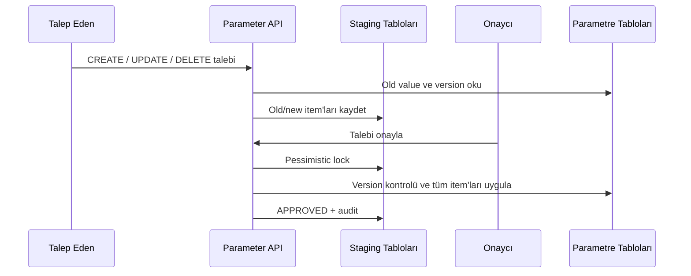

# Mimari

## Yazma akışı



Canlı parametre tabloları için doğrudan generic write endpoint bulunmaz. Bütün yazma işlemleri
`PM_CHANGE_REQUEST` ve `PM_CHANGE_ITEM` üzerinden ilerler. Bir talepteki bütün item'lar aynı
Oracle transaction'ında uygulanır.

## Güven sınırları

- Yalnızca `@ParameterResource` entity'leri registry'ye alınır.
- Yalnızca `@ParameterField` alanları JSON girişinde, grid'de ve snapshot'ta kullanılabilir.
- Filtre ve sort alanları metadata whitelist'i üzerinden doğrulanır.
- Serbest SQL endpoint'i yoktur. Join veya projection gereken ekranlar kayıtlı
  `CustomQueryProvider` implementasyonu kullanır.
- `X-User-*` header'ları yalnızca güvenilir gateway tarafından üretilmelidir. Gateway dış istemciden
  gelen aynı isimli header'ları silmeli, kendi kimlik doğrulama sonucuyla yeniden yazmalıdır.

## Aggregate create

CREATE item'ı `clientReference` yayınlayabilir. Sonraki item, `referenceBindings` içindeki hedef entity
alanını bu referansa bağlar. Onay motoru parent item'ı önce persist/flush eder, ID değerini child
alana dönüştürür ve atar.

```json
{
  "clientReference": "product-1",
  "resourceCode": "LOAN_PRODUCT",
  "operation": "CREATE",
  "executionOrder": 10,
  "newValue": { "code": "TL_NEW", "name": "Yeni Ürün", "currency": "TRY", "status": "ACTIVE" }
}
```

```json
{
  "resourceCode": "LOAN_RATE",
  "operation": "CREATE",
  "referenceBindings": { "productCode": "product-1" },
  "executionOrder": 20,
  "newValue": { "termMonth": 12, "minAmount": 10000, "interestRate": 4.35, "effectiveFrom": "2026-09-01" }
}
```

## Yeni parametre entity'si ekleme

1. JPA entity'sine `@ParameterResource` ekle.
2. İzinli kolonları `@ParameterField` ile işaretle.
3. Sorgulanabilir kolonlara `@FilterField` ekle.
4. Lookup alanına `@ReferenceField`, sabit listeye `@StaticOptions` ekle.
5. Oracle migration ile tablo/constraint/index tanımlarını ekle.
6. Resource metadata ve onay akışı testlerini ekle.

## Özel sorgu ekleme

`CustomQueryProvider` uygula ve sınıfa benzersiz kodlu `@CustomParameterQuery` ekle. Provider filtre
ve kolon metadata'sını React ekranına verir; sorgunun parametre bağlama ve projection mantığını kendi
içinde uygular. Kullanıcıdan tablo, kolon veya SQL metni alınmaz.

